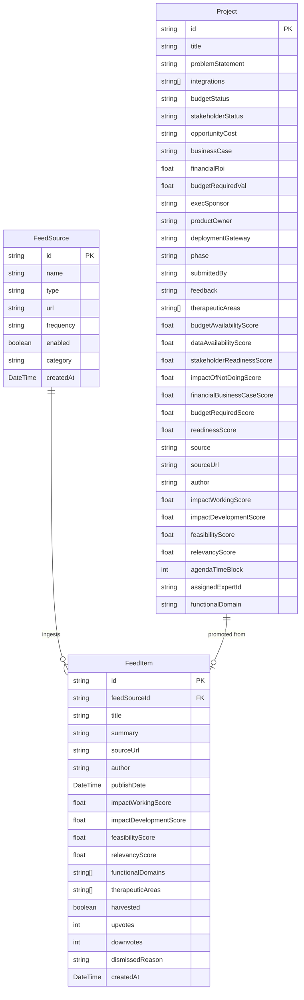
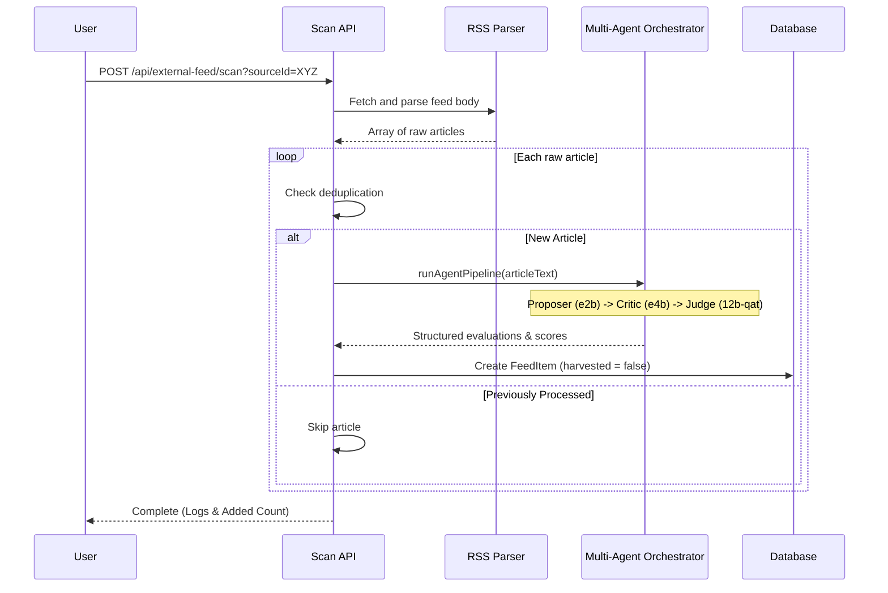

# Idea Harvester: Enterprise AI Scanning & Curation Platform

Idea Harvester is an advanced, multi-agent automated system designed to scan external feeds (RSS feeds, website scrapers, newsletter extracts), extract emerging artificial intelligence concepts, evaluate and rank them using a multi-agent LLM judge pipeline, and organize them into a prioritized backlog for enterprise alignment.

---

## 1. Application Overview
The Idea Harvester dashboard is organized into logical functional modules matching the enterprise workflow. The navigation structure is split into four primary sections:

*   **Home (`/`)**: Key overview of the backlog refresh schedules, core system weights, and system health status.
*   **Session Builder**:
    *   **Idea Library (`/external-scan`)**: The central repo showing all successfully ingested and approved AI ideas.
    *   **Prioritized Ideas (`/marketplace`)**: Curated idea backlog where teams can refine details, upvote, delete, or promote ideas to "Backlog" or "Working" status.
    *   **Agenda Builder (`/lifecycle`)**: Meeting planning module where scheduled ideas are assigned time blocks, speakers, and external vendor partners for presentation.
*   **Source Ideas**:
    *   **Operations (`/operations`)**: Operational dashboard displaying active scan runs, real-time scrolling progress bars with cycling indicators, and persistent run history logs.
    *   **Transcript Ingestion (`/intake`)**: Processing engine for raw meeting transcripts, extracting action items and concepts.
    *   **Idea Graveyard (`/archive`)**: The storage for ideas that were manually dismissed or automatically rejected by the multi-agent LLM Judge. Allows viewing rejections and restoring them.

---

## 2. Functional Requirements

### Feed Scan & Ingestion Pipeline
*   **Dynamic Source Registration**: Users can register feed pipelines of three types: **RSS Feed**, **Website Scraper**, and **Newsletter Extract**.
*   **Persistent Configuration**: Feed sources are configured with frequency intervals (Real-time, Hourly, Daily, Weekly) and categories (e.g., Pharma Business, Digital Health).
*   **Aborting Runs**: Ingestion scanning runs asynchronously in the background. Users can trigger scans and have the option to abort a running task at any time.
*   **Deduplication**: The backend tracks previously processed article URLs to prevent double-ingestion of identical concepts.

### Multi-Agent LLM Evaluation Engine
To ensure highly robust evaluations, scanning does not rely on a single LLM prompt. Instead, it utilizes a multi-agent orchestration pattern:
1.  **Proposer Agent**: Summarizes and presents the key concept extracted from the raw feed input.
2.  **Critic Agent**: Challenges the proposal, evaluating its limitations, requirements, and compliance.
3.  **Judge Agent**: Aggregates proposer/critic feedback, computes scores, assigns therapeutic categories, and renders the final verdict (`fitForCouncil`).

### Scoring & Relevancy System
Ideas are evaluated against three core enterprise metrics (0 to 100):
*   **Future Ways of Working ($W_k$)**: Impact on clinical, field force, and marketing operations.
*   **Ways of Development ($W_d$)**: Tech stack readiness, alignment, and implementation ease.
*   **Commercial Feasibility & Scalability ($C$)**: Return on investment, compliance, and target integration feasibility.
*   **Dynamic Relevancy Score**: Computed as a weighted average:
    $$\text{Relevancy} = (W_k \times w_1) + (W_d \times w_2) + (C \times w_3)$$
    *Default weights are configured at $w_1 = 0.40$, $w_2 = 0.30$, $w_3 = 0.30$ and can be fine-tuned via settings.*

### Review & Curation Flow
*   **Upvoting/Downvoting**: Users can downvote ideas in the library. Downvoting triggers a feedback popup asking for a reason, which automatically archives the item.
*   **Restoration**: Ingested articles rejected by the Judge (`fitForCouncil === false`) are captured with a default downvote count of 1 and a reason. They reside in the **Idea Graveyard** under "Rejected Ingestion Feed Items" and can be restored back to the Library.

---

## 3. Technical Requirements & Stack

*   **Framework**: Next.js 16 (App Router) with React 19.
*   **Styling**: TailwindCSS (v4) with custom components, featuring glassmorphism, responsive grid cards, and micro-animations.
*   **Database**: PostgreSQL with `pgvector` extension enabled for semantic similarity mapping.
*   **ORM**: Prisma Client utilizing PostgreSQL native Driver Adapters (`@prisma/adapter-pg`).
*   **LLM Models**:
    *   **Proposer**: `liquid/lfm2-24b-a2b`
    *   **Critic**: `liquid/lfm2-24b-a2b`
    *   **Judge / Forecaster**: `nvidia/nemotron-3-nano-omni` (Local inference endpoint)
    *   **Embeddings**: `text-embedding-nomic-embed-text-v2-moe` (Local embeddings endpoint)
*   **State Management**: React Context / persistent server-side polling for running scan jobs.

---

## 4. Technical Architecture

### Database Schema Entity Relationship

### Ingestion & Scoring Sequence

---

## 5. User Guide

### 1. Managing Sources & Crawlers
1.  Navigate to **Source Ideas -> Operations** from the sidebar.
2.  Use the **Add Custom Ingestion Source** form. Fill in:
    *   **Source Name** (e.g. OpenAI Blog)
    *   **Feed Type** (RSS Feed, Website Scraper, or Newsletter Extract)
    *   **Source URL / Endpoint** (e.g. `https://openai.com/news/rss.xml`)
    *   **Category** & **Scan Frequency**
3.  Click **Add Pipeline**. You can toggle pipelines on/off using the switches.

### 2. Triggering Scans
1.  In **Operations**, click **Run Ingestion Scan (All Feeds)**.
2.  Progress bars for each source will update live with cycling funny status messages.
3.  Ingestion logs will print to the Operations Log table below.

### 3. Reviewing & Prioritizing
1.  Go to **Session Builder -> Idea Library**. 
2.  Filter concepts using the category pill buttons (e.g., Pharma Business, General).
3.  Click on any card to see its full detail, scores, and **Implication for Pfizer**.
4.  Promote valid concepts using **Push to Backlog** (which converts them into Projects in the Curated Backlog).
5.  Dismiss non-relevant concepts by clicking the **Downvote** button.

### 4. Meeting Session Scheduling
1.  Navigate to **Session Builder -> Agenda Builder**.
2.  Assign time durations (in minutes), select an internal expert speaker, and associate external partner vendors to any project.
3.  Save changes to compile the final meeting agenda.
